# Publikasi dan System Evaluasi Jurusan

Integrated governance, evaluation, academic/OBE, resources, accreditation registry, and public transparency system untuk Jurusan/UPPS.

## Prinsip Utama

> **One Data → One Workflow → Evaluate → Approve → Publish**

Portal publik **bukan sistem data kedua**. Portal publik adalah read-only projection dari data internal yang telah melewati workflow, approval, dan publication policy sesuai jenis objeknya. Data yang sudah efektif/published tidak di-overwrite atau dihapus tanpa jejak; perubahan menggunakan versioning/archive.

## Arsitektur Konseptual — Klaster LAM Teknik

Arsitektur operasional dikelompokkan dalam tiga klaster **INPUT → PROCESS → OUTPUT/OUTCOME** agar mudah disandingkan dengan LED, LKPS, matriks penilaian, dan borang akreditasi. Pengelompokan ini adalah **accreditation view** atas data yang sama, bukan database baru.

```mermaid
flowchart LR
    subgraph I[INPUT / MASUKAN]
      I1[Organisasi UPPS & Prodi]
      I2[VMTS · Renstra · Standar · Target KPI]
      I3[SDM]
      I4[Sarpras · Laboratorium · Equipment · K3L]
      I5[Kurikulum · Profil Lulusan · CPL · CPMK]
      I6[Mahasiswa Input]
      I7[Kerja Sama & Sumber Pendukung]
    end

    subgraph P[PROCESS / PROSES]
      P1[Tata Kelola & Pelaksanaan Renstra]
      P2[Pendidikan / Pembelajaran / OBE]
      P3[Penelitian & PkM]
      P4[Pemanfaatan Lab · Maintenance · K3L]
      P5[Measurement KPI + Evidence]
      P6[SPMI: Verifikasi · Evaluasi · Temuan]
      P7[Rekomendasi · Tindak Lanjut · Verifikasi Efektivitas]
      P8[Approval & Governance Decision]
    end

    subgraph O[OUTPUT / OUTCOME]
      O1[Capaian KPI]
      O2[Capaian CPL · Lulusan · Outcome Lulusan]
      O3[Luaran Penelitian & PkM]
      O4[Kinerja Pemanfaatan Sumber Daya]
      O5[Hasil Kerja Sama]
      O6[Efektivitas Tindak Lanjut / Peningkatan Mutu]
      O7[Laporan Kinerja & Informasi Publik]
    end

    I --> P --> O

    I --> A[Accreditation Mapping]
    P --> A
    O --> A
    A --> B[Framework / Kriteria / Indikator]
    A --> C[LED / LKPS / Evidence Readiness]

    O --> D[Publication Layer]
    D --> E[Portal Publik]
```



### Prinsip Mapping IPO

- **INPUT/Masukan** = sumber daya, kebijakan, standar, rencana, struktur, kurikulum, dan kondisi awal yang memungkinkan proses berjalan.
- **PROCESS/Proses** = pelaksanaan tridharma, tata kelola, pengukuran, SPMI, evaluasi, tindak lanjut, serta pengendalian.
- **OUTPUT/OUTCOME** = capaian kinerja, CPL/lulusan, luaran tridharma, hasil kerja sama, efektivitas peningkatan mutu, dan informasi yang dapat dipertanggungjawabkan.
- Satu domain dapat berkontribusi pada lebih dari satu klaster. Contoh laboratorium: **equipment = input**, **utilization/maintenance/K3L = process**, **utilization/safety performance = output**.
- Kriteria dan indikator tetap mengikuti framework/instrumen lembaga akreditasi yang dipilih. IPO adalah view lintas-framework, bukan pengganti struktur resmi masing-masing LAM/BAN-PT.

Lihat:

- `docs/15-lam-teknik-ipo-crosswalk.md`
- `docs/16-dynamic-accreditation-framework-registry.md`

## Scope

Sistem mendukung lebih dari satu Jurusan dan lebih dari satu Program Studi. Objek strategis mempunyai scope eksplisit:

```text
UPPS/Jurusan  -> studyProgramId = NULL
Program Studi -> studyProgramId = ID Prodi
```

D3 Nautika dan D3 Ketatalaksanaan Pelayaran Niaga adalah data awal Jurusan Kemaritiman, bukan batas source code.

## Dua Lapisan, Satu Sumber Data

**Internal Governance Workspace**: create/update, evidence, evaluation, follow-up, approval, archive/versioning, publication execution.

**Public Portal**: read/search/filter/visualize/download data dan dokumen yang telah disahkan untuk publik.

## Domain Sistem

1. Organisasi & Master Data
2. Perencanaan Strategis
3. Akademik & OBE
4. Sumber Daya
5. Kinerja & KPI
6. Penjaminan Mutu
7. Akreditasi & Kepatuhan
8. Publikasi & Transparansi
9. Administrasi & Audit Trail

Domain di atas tetap menjadi struktur data/aplikasi. **INPUT–PROCESS–OUTPUT/OUTCOME adalah view lintas-domain untuk kebutuhan mutu dan akreditasi.**

## Role Baseline

- **Admin Sistem** — konfigurasi, organisasi/Prodi, user, role, master teknis, registry framework akreditasi.
- **Admin Data** — input data/konten/evidence dan eksekusi publish setelah approval.
- **Kaprodi** — data, Renstra/KPI, kurikulum dan tindak lanjut dalam scope Prodi.
- **GKM** — verifikasi mutu, evaluasi, temuan, rekomendasi.
- **Sekjur** — koordinasi administratif dan review.
- **Kajur/UPPS** — approval tingkat UPPS dan keputusan strategis.
- **Viewer Internal** — read-only sesuai scope.
- **Publik** — read-only terhadap projection yang telah disahkan.

Role bersifat dinamis di database, sementara capability keamanan tetap dikontrol application services.

## Status Implementasi

### Phase 1–4 — MVP DONE

Authentication/dynamic RBAC, organisasi/Prodi, audit/versioning/evidence, VMTS/Renstra, KPI target–realisasi, generic Evaluation Engine, finding/recommendation/follow-up, verification, approval, publication layer, berita, public KPI/evaluation/statement dashboard.

### Phase 5 — Academic & OBE — VERTICAL SLICE

Vertical slice awal tersedia. Struktur kurikulum/OBE akan disempurnakan kembali setelah seluruh domain utama berjalan.

### Phase 6 — Resources and Extended Domains — LOCAL SIMULATION READY

Sudah tersedia di `main`:

- laboratorium lintas Prodi;
- equipment;
- utilization;
- maintenance;
- K3L;
- SDM/personnel;
- penelitian;
- PkM;
- mahasiswa/lulusan;
- kerja sama;
- public projection dan `/internal/resources`.

### Dynamic Accreditation Registry — FOUNDATION AVAILABLE

Registry mendukung:

```text
Program Studi
→ Accreditation Agency
→ Framework / Instrument Version
→ Criteria
→ Cluster(s)
→ Indicators
→ Evidence Requirements
→ Source Mapping
```

Seed awal menggunakan LAM Teknik 2025 reference structure sebagai model awal. Assignment framework ke Prodi bersifat eksplisit dan tidak otomatis.

## Separation of Duties & Scope Security

Permission saja tidak cukup untuk tindakan formal. Evaluation, approval, publication, follow-up, verification, dan assignment akreditasi juga memeriksa scope objek/Program Studi.

## Quick Local Simulation

Untuk membuat instance Jurusan dari aplikasi Master, ikuti [panduan provisioning lokal dan VPS](docs/PROVISIONING-LOCAL-VPS.md).

Prasyarat: Node.js 22.13+ dan MySQL 8.x.

```bash
npm install
npm run setup:local
npm run dev
```

`setup:local` menjalankan:

```text
db:push
→ db:seed
→ db:backfill-scopes
→ bootstrap:admin
```

Sebelum itu buat `.env.local` dari `.env.example` dan sesuaikan `DATABASE_URL`, `AUTH_SECRET`, serta akun bootstrap admin.

Panduan lengkap: `docs/17-local-simulation.md`.

Validation command:

```bash
npm run check
```

## Roadmap Berikutnya

- **Phase 5 refinement:** perbaikan struktur kurikulum/OBE setelah keseluruhan sistem berjalan.
- **Phase 7 — Accreditation & Compliance:** indicator-to-source mapping, evidence readiness, self-assessment, gap analysis, improvement action, official accreditation status, dan borang/LED/LKPS views.
- **Phase 8 — Analytics:** trend, early warning, KPI/OBE/lab/accreditation readiness.
- **Phase 9 — Integration:** integrasi/migrasi dengan website Jurusan yang telah ada.
