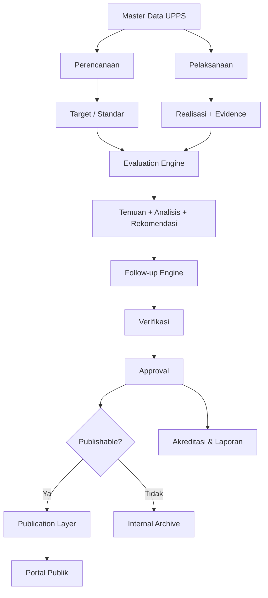

# Publikasi dan System Evaluasi Jurusan

Blueprint arsitektur untuk sistem tata kelola Jurusan/UPPS yang menyatukan:

- perencanaan strategis;
- pengelolaan program studi;
- KPI dan kinerja;
- penjaminan mutu;
- evaluasi dan tindak lanjut;
- akreditasi dan kepatuhan;
- publikasi informasi publik.

## Prinsip Utama

> **One Data → One Workflow → Evaluate → Approve → Publish**

Portal publik **bukan sistem data kedua**. Portal publik adalah **read-only projection** dari data internal yang sudah diverifikasi, dievaluasi, disetujui, dan ditetapkan layak publikasi.

Tidak boleh ada duplikasi seperti:

- `internal_vision` dan `public_vision`;
- `internal_kpi` dan `public_kpi`;
- `internal_accreditation` dan `public_accreditation`.

Yang ada adalah satu objek sumber dengan lifecycle dan publication policy.

## Arsitektur Konseptual



## Dua Lapisan, Satu Sumber Data

### Internal Governance Workspace

Memiliki fungsi:

- create;
- update;
- verify;
- evaluate;
- recommend;
- follow-up;
- approve;
- archive;
- publish.

### Public Portal

Memiliki fungsi:

- read;
- search;
- filter;
- visualize;
- download dokumen publik.

Public portal tidak memiliki editor data substantif terpisah.

## Domain Sistem

1. **Organisasi & Master Data**
2. **Perencanaan Strategis**
3. **Akademik & Program Studi**
4. **Sumber Daya**
5. **Kinerja & KPI**
6. **Penjaminan Mutu**
7. **Akreditasi & Kepatuhan**
8. **Publikasi & Transparansi**
9. **Administrasi & Audit Trail**

## Struktur Repository

```text
publikasi-dan-system-evaluasi-jurusan/
├── README.md
├── ARCHITECTURE.md
├── DECISIONS.md
├── docs/
│   ├── 01-end-to-end-pipeline.md
│   ├── 02-information-architecture.md
│   ├── 03-modules-and-domains.md
│   ├── 04-roles-and-permissions.md
│   ├── 05-data-model.md
│   ├── 06-evaluation-engine.md
│   ├── 07-publication-layer.md
│   ├── 08-accreditation-and-compliance.md
│   └── 09-implementation-roadmap.md
├── diagrams/
│   ├── system-context.mmd
│   ├── end-to-end-pipeline.mmd
│   └── publication-flow.mmd
├── database/
│   └── schema.sql
├── config/
│   ├── roles.example.yml
│   └── publication-policy.example.yml
└── .gitignore
```

## Lifecycle Data

Lifecycle umum:

```text
DRAFT
  ↓
SUBMITTED
  ↓
VERIFIED
  ↓
EVALUATED
  ↓
APPROVED
  ↓
EFFECTIVE
  ↓
PUBLISHED
  ↓
ARCHIVED
```

Tidak semua objek wajib melewati seluruh state, tetapi seluruh perubahan harus tercatat.

## Contoh: Visi Jurusan

```text
Admin/Authorized Editor
      ↓
Input Draft Visi
      ↓
Review / Verification
      ↓
Approval Kajur
      ↓
Status = EFFECTIVE
      ↓
Publish = TRUE
      ↓
Portal Publik membaca versi efektif
```

Portal publik tidak menyediakan kolom "ketik visi".

## Contoh: KPI

```text
Renstra
  ↓
Sasaran Strategis
  ↓
KPI
  ↓
Target
  ↓
Realisasi
  ↓
Evidence
  ↓
Evaluasi
  ↓
Temuan / Gap
  ↓
Rekomendasi
  ↓
Tindak Lanjut
  ↓
Verifikasi
  ↓
Approval
  ↓
Public Projection
```

## Role Utama

- **Admin Sistem** — konfigurasi, master data, teknis.
- **Admin Konten/Data** — input data dan evidence sesuai kewenangan.
- **Kaprodi** — data, kinerja, kurikulum, dan tindak lanjut prodi.
- **GKM** — verifikasi mutu, evaluasi, temuan, rekomendasi.
- **Sekjur** — koordinasi administratif dan verifikasi.
- **Kajur/UPPS** — approval dan keputusan tingkat jurusan.
- **Viewer Internal** — akses baca sesuai cakupan.
- **Publik** — akses ke data yang sudah dipublikasikan.

## Prinsip Otorisasi

Admin tidak menjadi evaluator substansi mutu.

Pihak yang memasukkan data dapat berbeda dari:

- pihak yang memverifikasi;
- pihak yang mengevaluasi;
- pihak yang menyetujui;
- pihak yang mempublikasikan.

## Target Implementasi

Blueprint ini disiapkan agar dapat diimplementasikan sebagai aplikasi web modular dengan stack seperti:

- Next.js;
- React;
- relational database;
- ORM;
- role-based access control;
- audit trail;
- object storage untuk evidence;
- API/public projection untuk portal.

Lihat `docs/09-implementation-roadmap.md`.
