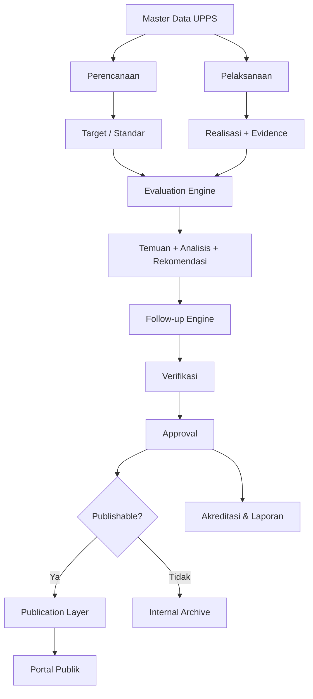

# Publikasi dan System Evaluasi Jurusan

Blueprint dan MVP untuk sistem tata kelola Jurusan/UPPS yang menyatukan perencanaan strategis, program studi, KPI, penjaminan mutu, evaluasi dan tindak lanjut, akreditasi/kepatuhan, serta publikasi informasi publik.

## Prinsip Utama

> **One Data → One Workflow → Evaluate → Approve → Publish**

Portal publik **bukan sistem data kedua**. Portal publik adalah read-only projection dari data internal yang sudah diverifikasi, dievaluasi, disetujui, dan ditetapkan layak publikasi. Tidak ada `internal_vision/public_vision`, `internal_kpi/public_kpi`, atau salinan data akreditasi khusus portal.

## Arsitektur Konseptual



## Dua Lapisan, Satu Sumber Data

**Internal Governance Workspace**: create, update, verify, evaluate, recommend, follow-up, approve, archive, publish.

**Public Portal**: read, search, filter, visualize, dan download data/dokumen yang memang telah disahkan untuk publik.

Public portal tidak memiliki editor data substantif terpisah.

## Domain Sistem

1. Organisasi & Master Data
2. Perencanaan Strategis
3. Akademik & Program Studi
4. Sumber Daya
5. Kinerja & KPI
6. Penjaminan Mutu
7. Akreditasi & Kepatuhan
8. Publikasi & Transparansi
9. Administrasi & Audit Trail

## Lifecycle

```text
DRAFT → SUBMITTED → VERIFIED → EVALUATED → APPROVED → EFFECTIVE → PUBLISHED → ARCHIVED
```

Tidak semua objek wajib melewati seluruh state, tetapi perubahan penting harus memiliki audit trail.

## Role Utama

- Admin Sistem — konfigurasi, user/role, master teknis.
- Admin Data — input data/evidence dan eksekusi publish setelah approval.
- Kaprodi — data, kinerja, kurikulum, tindak lanjut dalam scope Prodi.
- GKM — verifikasi mutu, evaluasi, temuan, rekomendasi.
- Sekjur — koordinasi administratif dan review.
- Kajur/UPPS — approval tingkat UPPS dan keputusan publikasi.
- Viewer Internal — read-only internal.
- Publik — read-only terhadap projection yang telah disahkan.

## Status Implementasi MVP Phase 1–4

Phase 1–4 sudah mempunyai vertical slice implementasi berbasis Next.js, React, Drizzle ORM, dan MySQL. Cakupannya: authentication/RBAC, organisasi dan dua program studi, VMTS/Renstra, KPI/target/realisasi, evidence, evaluation engine, findings/recommendations/follow-up, verification, approval, publication policy, publication queue, public API, public KPI, public strategic statements, public evaluation summary, dan public dashboard.

Lihat `docs/10-mvp-phase-1-4.md` untuk setup dan batas MVP.

## Separation of Duties

Admin tidak menjadi evaluator substansi mutu. Kelayakan publikasi ditentukan oleh evaluator/reviewer/approver; Admin Data hanya menjalankan aksi publication pada objek yang telah lolos approval dan policy. Endpoint publication menolak objek yang belum memenuhi syarat tersebut.

## Tahap Berikutnya

Phase 5–9 mencakup OBE/kurikulum, akreditasi configurable, laboratorium/SDM/riset/PkM/mahasiswa/kerja sama, analytics, dan integrasi dengan website Jurusan Kemaritiman yang sudah ada.
