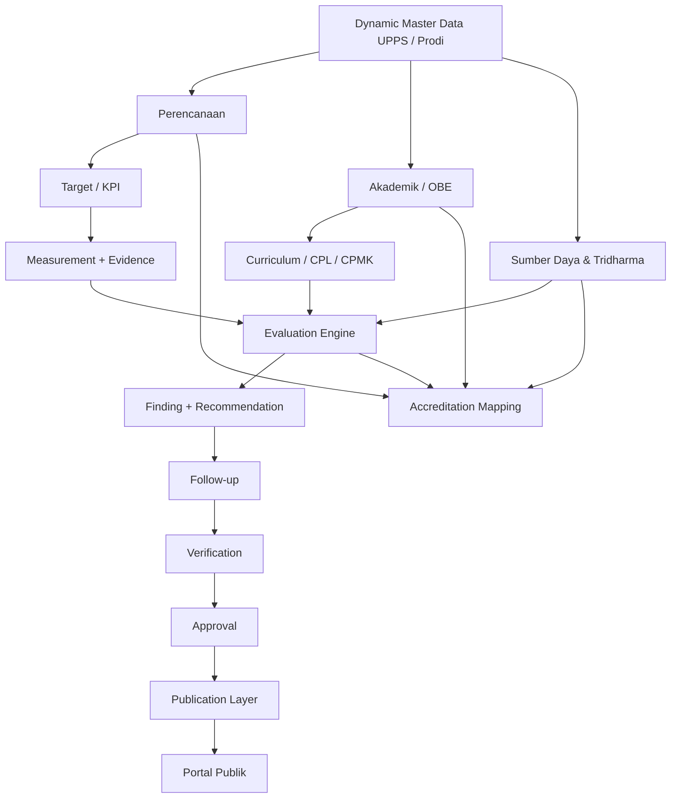

# Publikasi dan System Evaluasi Jurusan

Integrated governance, evaluation, academic/OBE, and public transparency system untuk Jurusan/UPPS.

## Prinsip Utama

> **One Data → One Workflow → Evaluate → Approve → Publish**

Portal publik **bukan sistem data kedua**. Portal publik adalah read-only projection dari data internal yang telah melewati workflow, approval, dan publication policy sesuai jenis objeknya. Data yang sudah efektif/published tidak di-overwrite atau dihapus tanpa jejak; perubahan menggunakan versioning/archive.

## Arsitektur Konseptual



## Scope

Sistem mendukung lebih dari satu Jurusan dan lebih dari satu Program Studi. Objek strategis mempunyai scope eksplisit:

```text
UPPS/Jurusan  -> studyProgramId = NULL
Program Studi -> studyProgramId = ID Prodi
```

D3 Nautika dan D3 Ketatalaksanaan Pelayaran Niaga adalah data awal Jurusan Kemaritiman, bukan batas source code.

## Dua Lapisan, Satu Sumber Data

**Internal Governance Workspace**: create/update, evidence, evaluation, follow-up, approval, archive/versioning, publication execution.

**Public Portal**: read/search/filter/visualize/download data dan dokumen yang telah disahkan untuk publik.

## Domain Sistem

1. Organisasi & Master Data
2. Perencanaan Strategis
3. Akademik & OBE
4. Sumber Daya
5. Kinerja & KPI
6. Penjaminan Mutu
7. Akreditasi & Kepatuhan
8. Publikasi & Transparansi
9. Administrasi & Audit Trail

## Role Baseline

- **Admin Sistem** — konfigurasi, organisasi/Prodi, user, role, master teknis.
- **Admin Data** — input data/konten/evidence dan eksekusi publish setelah approval.
- **Kaprodi** — data, Renstra/KPI, kurikulum dan tindak lanjut dalam scope Prodi.
- **GKM** — verifikasi mutu, evaluasi, temuan, rekomendasi.
- **Sekjur** — koordinasi administratif dan review.
- **Kajur/UPPS** — approval tingkat UPPS dan keputusan strategis.
- **Viewer Internal** — read-only sesuai scope.
- **Publik** — read-only terhadap projection yang telah disahkan.

Role bersifat dinamis di database, sementara capability keamanan tetap dikontrol application services.

## Status Implementasi

### Phase 1–4

Implemented: authentication/dynamic RBAC, organisasi/Prodi, audit/versioning/evidence, VMTS/Renstra, KPI target–realisasi, generic Evaluation Engine, finding/recommendation/follow-up, verification, approval, publication layer, berita, public KPI/evaluation/statement dashboard.

### Phase 5 — Academic & OBE

Implemented vertical slice:

- curriculum version per Prodi;
- profil lulusan;
- CPL;
- master mata kuliah;
- curriculum-course mapping;
- CPMK;
- CPMK–CPL mapping;
- curriculum review memakai generic Evaluation Engine;
- stakeholder metadata;
- staged import dari Google Sheet/CSV/JSON/manual;
- approval dan publication kurikulum;
- `/internal/academic`;
- `/akademik` dan `/api/public/curricula`.

Lihat `docs/13-phase5-academic-obe.md`.

## Separation of Duties & Scope Security

Permission saja tidak cukup untuk tindakan formal. Evaluation, approval, dan publication juga memeriksa scope objek. User yang hanya mempunyai scope Prodi A tidak dapat memproses objek Prodi B atau objek UPPS tanpa UPPS write scope.

## Database Update

```bash
npm run db:push
npm run db:seed
npm run db:backfill-scopes
```

## Roadmap Berikutnya

- **Phase 6 — Resources and Extended Domains:** laboratorium bersama lintas Prodi, equipment, utilization, maintenance, K3L, SDM, penelitian, PkM, mahasiswa/lulusan, kerja sama.
- **Phase 7 — Accreditation & Compliance:** configurable BAN-PT/LAM/standar lain sebagai mapping/consumer dari data Phase 1–6.
- **Phase 8 — Analytics:** trend, early warning, KPI/OBE/lab/accreditation readiness.
- **Phase 9 — Integration:** integrasi/migrasi dengan website Jurusan yang telah ada.
