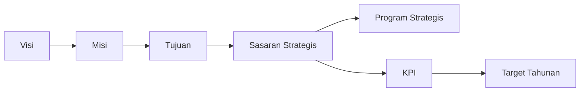
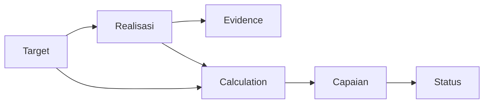
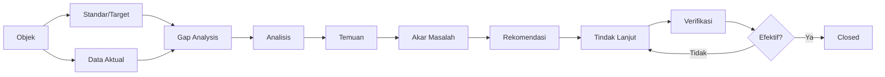
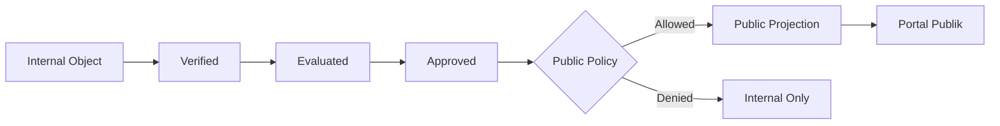
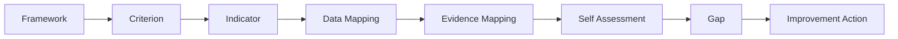

# End-to-End Pipeline

## A. Planning Pipeline



## B. Performance Pipeline



## C. Quality Pipeline



## D. Publication Pipeline



## E. Accreditation Pipeline



## F. Governance Loop

```text
PLAN
  ↓
EXECUTE
  ↓
MEASURE
  ↓
EVALUATE
  ↓
IMPROVE
  ↓
APPROVE
  ↓
PUBLISH
  ↓
REVIEW NEXT CYCLE
```
