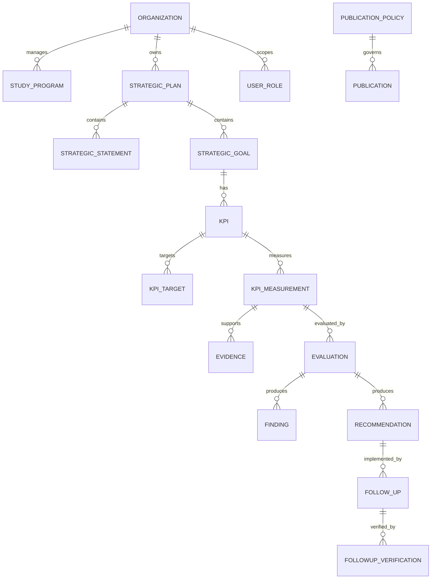

# Data Model

## Core Relationships



## Strategic Statements

Agar struktur tetap ramping, visi, misi, tujuan, dan strategi menggunakan satu tabel `strategic_statements` dengan `statement_type`:

```text
VISION
MISSION
OBJECTIVE
STRATEGY
```

Setiap statement mempunyai versi, lifecycle status, dan periode efektif.

## Generic Subject Reference

Untuk evaluation, evidence, approval, publication, versioning, dan audit:

```text
subject_type
subject_id
```

Pendekatan ini membuat mekanisme mutu dan publikasi dapat digunakan lintas domain tanpa tabel proses yang berulang.

## Versioning

Selain version field pada objek strategis, `object_versions` menyimpan snapshot perubahan penting untuk audit dan rollback konseptual.

## Publication Policy

`publication_policies` menyimpan aturan tipe objek dan field yang boleh dipublikasikan. `publications` menyimpan keputusan publikasi per objek yang telah lolos approval.
