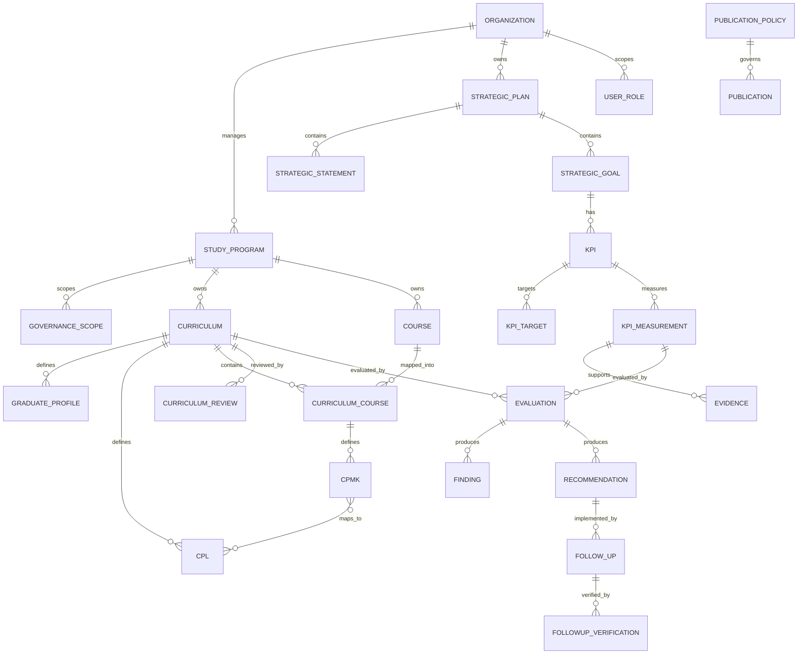

# Data Model

## Core Relationships



## Strategic Scope

Strategic objects menggunakan `governance_scopes` agar satu model dapat digunakan pada level:

```text
UPPS/Jurusan: study_program_id = NULL
Program Studi: study_program_id = <id prodi>
```

Ini berlaku untuk Renstra, strategic statement, sasaran, dan KPI. Dengan cara ini setiap Prodi dapat memiliki Renstra, visi/visi keilmuan, sasaran dan KPI sendiri tanpa membuat tabel duplikat.

## Strategic Statements

Visi, misi, tujuan, strategi, dan visi keilmuan menggunakan satu tabel `strategic_statements` dengan `statement_type`:

```text
VISION
MISSION
OBJECTIVE
STRATEGY
SCIENTIFIC_VISION
```

`SCIENTIFIC_VISION` wajib memiliki scope Program Studi.

## Academic / OBE Model

Kurikulum adalah objek versioned per Program Studi. Struktur OBE:

```text
Study Program
  → Curriculum Version
      → Graduate Profile
      → CPL
      → Curriculum Course
          → CPMK
              → Mapping CPMK–CPL
```

Evaluasi kurikulum tidak membuat evaluation engine kedua. `curriculum_review_cycles` menyimpan metadata siklus review/stakeholder, sedangkan analisis, temuan, rekomendasi, dan tindak lanjut memakai generic `evaluations`, `findings`, `recommendations`, dan `followups` dengan `subject_type = CURRICULUM`.

## OBE Import Staging

`obe_imports` menampung referensi impor dari Google Sheet/CSV/JSON/manual dalam status `STAGED`. Import tidak boleh menimpa data akademik aktif sebelum mapping dan validasi dilakukan.

## Generic Subject Reference

Untuk evaluation, evidence, approval, publication, versioning, dan audit:

```text
subject_type
subject_id
```

Pendekatan ini membuat mekanisme mutu dan publikasi dapat digunakan lintas domain tanpa tabel proses yang berulang.

## Versioning

Selain version field pada objek strategis dan kurikulum, `object_versions` menyimpan snapshot perubahan penting untuk audit. Objek `EFFECTIVE`, `APPROVED`, atau `PUBLISHED` tidak diedit in-place; perubahan substantif dibuat sebagai versi baru.

## Publication Policy

`publication_policies` menyimpan aturan tipe objek dan field yang boleh dipublikasikan. `publications` menyimpan keputusan publikasi per objek yang telah lolos approval. Kurikulum publik merupakan projection dari record `CURRICULUM` yang telah `EFFECTIVE` dan disetujui untuk publikasi.
