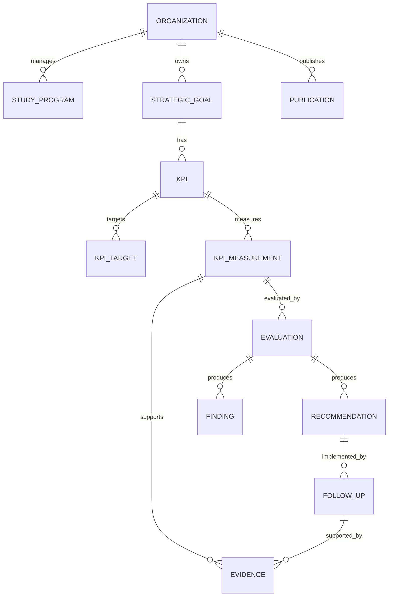

# Data Model

## Core Relationships



## Generic Subject Reference

Untuk evaluation, evidence, approval, dan publication:

```text
subject_type
subject_id
```

Contoh:

```text
subject_type = KPI_MEASUREMENT
subject_id   = 193
```

atau:

```text
subject_type = CURRICULUM
subject_id   = 28
```

Pendekatan ini mengurangi jumlah tabel lintas modul.

## Versioned Entities

Minimal:

- vision/mission;
- Renstra;
- curriculum;
- accreditation framework;
- policy/document.

Gunakan:

```text
version_number
effective_from
effective_to
status
supersedes_id
```
